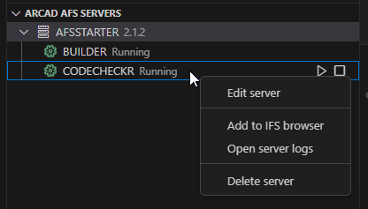

**ATTENTION** : For any demand or issue, Please do not use anymore GITHUB ISSUES. this will be desactivated soon for this project.
instead, Send an email to [support](support-eu@arcadsoftware.com) or use the ARCAD software customer portal :
[Support portal](https://akuiteo.arcadsoftware.com/akuiteo.clients/login/login.html)

3 issues where moved to the support :

Issue #28 --> TFR113047	GitHub -Server Stop Process error

Issue #39 --> TFR113046	GitHub -View Build Jobs - enhancement

Issue #40 --> TFR113045	GitHub -Transfer Log Display - Enhancement

# ARCAD-IBM i Servers Manager VSCode extension

[ARCAD-IBM i Servers Manager](https://marketplace.visualstudio.com/items?itemName=arcadsoftware.arcad-ibmi-servers) lets you manage your ARCAD Servers on IBM i from VSCode.

----------
This extension will add the `ARCAD Servers` view to the IBM i explorer provided by [Code for IBM i](https://marketplace.visualstudio.com/items?itemName=HalcyonTechLtd.code-for-ibmi).

This view will allow you to see all the ARCAD servers installed on your IBM i, check and edit their configuration and start/stop them...and much more! 🧰

# Get started
- 💻 Install the extension from [Marketplace](https://marketplace.visualstudio.com/items?itemName=arcadsoftware.arcad-ibmi-servers).
- 📘 Check out the [online documentation](https://arcad-software.github.io/arcad-ibmi-servers) to get started!
