# AFS servers management
AFS servers are backend servers for products like Builder, CodeChecker, Verifier, etc.

## Installation management
Before installing or updating, make sure you have the installation package (provided as a `.jar` file) located locally on your hard-drive. The package cannot be located on a network share for this to work.

### Install
There are two ways to start the installation process:
- Using the `Install new server` action 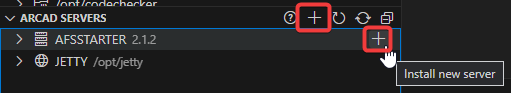
- By dragging and dropping the installation package into the ARCAD Servers view, at the root level or on an `AFSSTARTER` library. 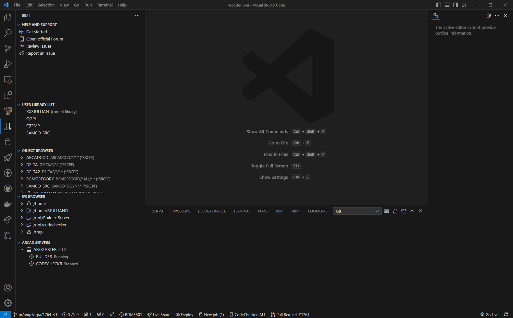

After you started the installation process, an editor will open to let you enter the installation details. Required/invalid fields will be highlighted in red.

The required fields are:
- IFS folder
- Job user

All the other fields can remain blank - meaning they will use the installatin package default values.

Clicking on the `Install` button will result in the installation package being uploaded to the IFS and executed with the provided values.

Once the installation is successful, the ARCAD Server browser will refresh itself.

The entire process output can be found in `Code for IBM i`'s output view.
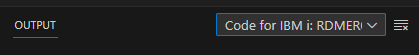

### Update
There are two ways to start the update process:
- Using the `Update` action from a server right-click menu 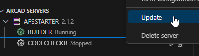
- By dragging and dropping the installation package onto the server to be updated. 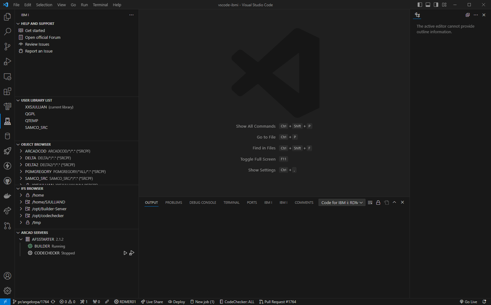

After one of this action has been carried out, the update process will begin automatically. It will upload the installation package and execute it.

The entire process output can be found in `Code for IBM i`'s output view.

## Server instance management
### Show
Clicking on a server will open a read-only editor displaying various information about the server instance. The instance parameters will always be displayed whereas the `About` and `Current job` tabs will only be displayed if the server is running.
<!-- tabs:start -->
#### **Instance**
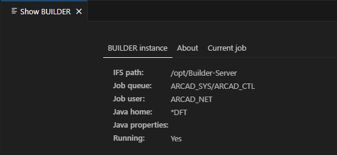

#### **About**
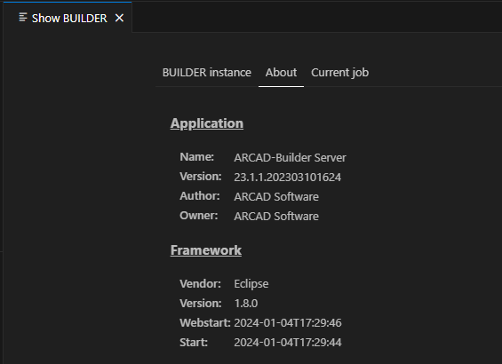

#### **Current job**
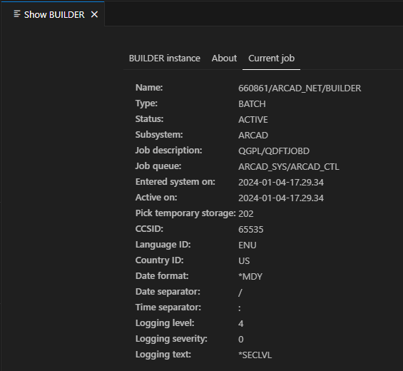
<!-- tabs:end -->

### Edit

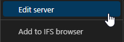

Use the `Edit` action from the server's right-click menu to open an editor allowing you to change the instances configuration. The editor shows the same fields as the `CHGAFSSFVR` command, with their current values.
Once you're done you can either choose to `Save` or `Save and restart`.

### Delete

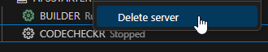

Use the `Delete server` action from the server's right-click menu to delete the selected server instance. You can then choose to delete just the instance from `AFSSTARTER` or to delete the server's IFS installation folder as well.

## Server files management
These actions are available from a server's right-click menu 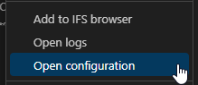
### Open configuration
This action will open the `<server directory>/configuration/osgi.cm.ini`. If the server is running, the file will be opened in read-only mode.

### Open logs
This action will open the `<server directory>/logs/server.log` read-only.

### Add installation location to the IFS browser
This will run `Code for IBM i` action to add a new IFS shortcut in the `IFS Browser`, pre-filling the prompt with the server's installation path. 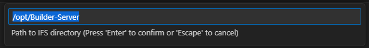

### Clear logs
Clearing the logs will remove all the files from the `<server directory>/logs` directory, provided you have enough authority to do so. This can only be done when the server is stopped.

### Clear configuration cache
Clearing the configuration cache will remove everything from the `<server directory>/configuration` folder, except the following items:
- org.eclipse.equinox.simpleconfigurator
- osgi.cm.ini
- config.ini

This can only be done when the server is stopped.