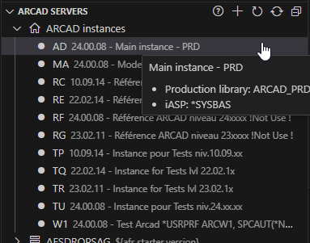
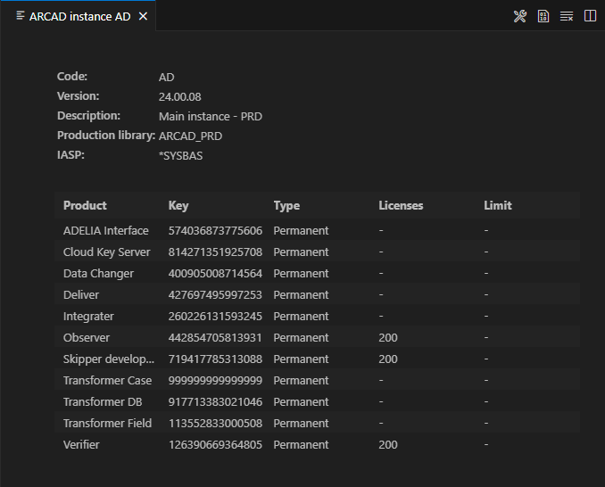
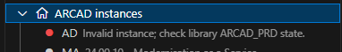
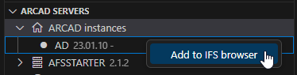

# ARCAD instances
If ARCAD is installed on the LPAR, the ARCAD Instances node will be displayed in the browser.

Every ARCAD instance found on the IBM i is listed under the ARCAD Instances node.

## Instance details and licenses
Clicking on an instance will open a read-only editor displaying the instance's details as well as its licenses.

### Invalid instance
If an instance is shown like below, it means its version could not be retrieved and its probably corrupt.

When this happens, check the instance's procution library state, it may be incomplete or deleted after an uninstallation but the instance was not removed from the instances file `ARCAD_SYS/AARCINSF1`. If that's the case, simply remove the instance from the instances file.

## Add ARCAD instance IFS root folder to the IFS browser
This will run `Code for IBM i` action to add a new IFS shortcut in the `IFS Browser`, pre-filling the prompt with ARCAD instance's IFS root folder (namely `/iasp/arc<instance code>IfsPrd`). 
