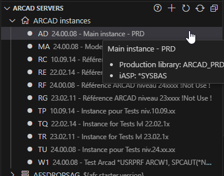
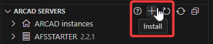
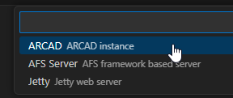
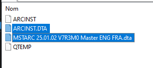
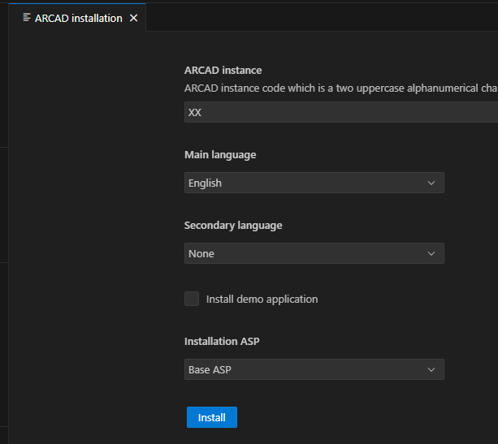
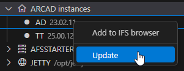
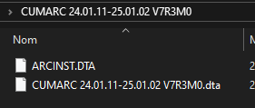
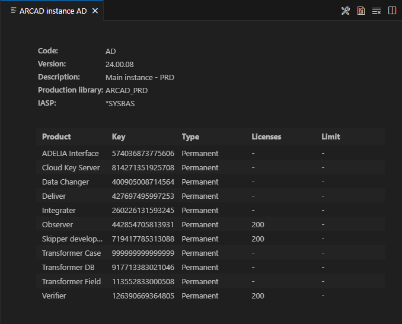
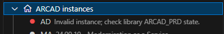
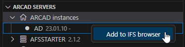

# ARCAD instances
If ARCAD is installed on the LPAR, the ARCAD Instances node will be displayed in the browser.

Every ARCAD instance found on the IBM i is listed under the ARCAD Instances node.

## Install
1. Click on the `Install` button in the `ARCAD Servers` browser and select `ARCAD instance`.

2. Select an installation package: it must be a zip file or a folder containing the `ARCINST.DTA` and a `MSTARC xxx .dta` files. To select a folder, just pick one of the `.dta` file in it.

3. A prompt will open to ask for the installation settings.

4. Click on `Install` to start the installation process in the back. 

The process will upload the installation package in a temporary IFS location and then submit the installation command. The submitted job will be monitored until its ends.

Once the installation job has ended, a notification will show up to display the result and to open the installation job's log.

## Update
1. Right click on an existing ARCAD instance and select `Update`

2. Select an update package: it must be a zip file or a folder containing the `ARCINST.DTA` and a `CUMARC xxx .dta` files. To select a folder, just pick one of the `.dta` file in it.

3. A dialog will show up to confirm the start of the update process. It will also warn if there's a version mismatch.

The process will upload the update package in a temporary IFS location and then submit the update command. The submitted job will be monitored until its ends.

Once the update job has ended, a notification will show up to display the result and offer to open the update job's log.

## Instance details and licenses
Clicking on an instance will open a read-only editor displaying the instance's details as well as its licenses.

### Invalid instance
If an instance is shown like below, it means its version could not be retrieved and its probably corrupt.

When this happens, check the instance's procution library state, it may be incomplete or deleted after an uninstallation but the instance was not removed from the instances file `ARCAD_SYS/AARCINSF1`. If that's the case, simply remove the instance from the instances file.

## Add ARCAD instance IFS root folder to the IFS browser
This will run `Code for IBM i` action to add a new IFS shortcut in the `IFS Browser`, pre-filling the prompt with ARCAD instance's IFS root folder (namely `/iasp/arc<instance code>IfsPrd`). 
