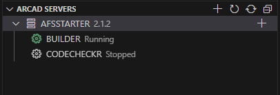

# Getting Started
1. Make sure you checked the [prerequisites](pages/prerequisites.md) and [Code for IBM i](https://marketplace.visualstudio.com/items?itemName=HalcyonTechLtd.code-for-ibmi) is up and running.
2. Connect to an IBM i
3. The ARCAD Servers view on the left will load the ARCAD servers management libraries  (e.g. `AFSSTARTER`). Expanding the library will show the list of installed servers.   

Check out the  [Server management](pages/server_management.md) page to see all the available actions brought by the `ARCAD Servers` view.