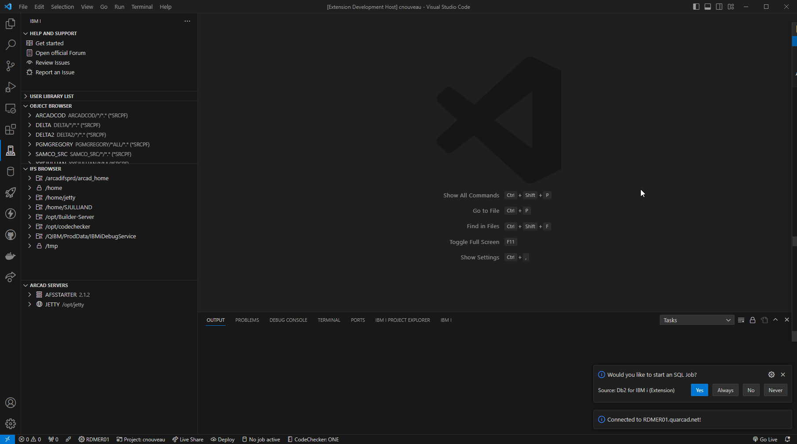

# Jetty Servers management
Jetty servers are web application servers, usually hosting one or more web applications like Elias REST API Server or Builder's Web Console.

## Installation management
Before installing, make sure you have the installation package (provided as a `.jar` file) located locally on your hard-drive. The package cannot be located on a network share for this to work.

There are two ways to start the installation process:
- Using the `Install new server` action 
- By dragging and dropping the installation package into the ARCAD Servers view, at the root level. 

After you started the installation process, an editor will open to let you enter the installation details. Required/invalid fields will be highlighted in red.

The required fields are: 
- IFS folder
- Job user

All the other fields can remain blank - meaning they will use the installatin package default values.

Clicking on the `Install` button will result in the installation package being uploaded to the IFS and executed with the provided values.

Once the installation is successful, the ARCAD Server browser will refresh itself.

The entire process output can be found in `Code for IBM i`'s output view.

## Install/Update WAR files
There are two ways to remotely install or update WAR files on Jetty:
- Using the `Install WAR files` action from a Jetty right-click menu 
- By dragging and dropping one or more WAR files onto the Jetty server node. 

After one of this action has been carried out, the WAR files installation will begin automatically. Jetty will be stopped, the files will be uploaded in Jetty's `webapps` folder and its `work` folder will be emptied. Jetty must be restarted manually after the process is done.

The entire process output can be found in `Code for IBM i`'s output view.

## Jetty job management
Jetty's job can be displayed by expanding Jetty's node. The node displayed will depend on the job's status.
<!-- tabs:start -->
#### **Running**

#### **Stopped**

<!-- tabs:end -->

The buttons to start and stop the job are found on right side of the job's node.

### Open application URL
Right-clicking on Jetty's job while it runs will show an action to open an application.

Clicking on this action will open a prompt listing all the applications installed in Jetty as well as its root. Selecting an application will open its URL in a web browser.

### Show
Clicking on a Jetty will open a read-only editor displaying various information about it. Jetty informations will always be displayed whereas the `Current job` tab will only be displayed if Jetty is running.
<!-- tabs:start -->
#### **Instance**

#### **Current job**

<!-- tabs:end -->

## Jetty server management

### Delete

Use the `Delete server` action from Jetty's right-click menu to delete the selected Jetty server. This will stop Jetty if it's running and delete its library and IFS folder.

## Jetty files management
These actions are available from Jetty's right-click menu

### Open configuration
This action will show a sub-menu to open the HTTP (`<server directory>/start.d/http.ini`) and HTTPS (`<server directory>/start.d/https.ini`) configuration files.

### Open logs
This action will open a prompt to select a log file to open.

### Add installation location to the IFS browser
This will run `Code for IBM i` action to add a new IFS shortcut in the `IFS Browser`, pre-filling the prompt with Jetty's installation path. 

### Clear logs
Clearing the logs will remove all the files from the `<server directory>/logs` directory, provided you have enough authority to do so.