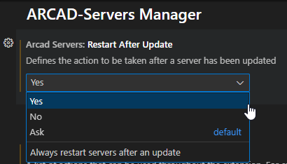

# Extension settings
## Restart after update
Defines whether a server should be restarted or not after an update. Possible values are:
- `Yes`: always restart after an update
- `No`: never restart after an update
- `Ask`: show a prompt with a `Restart` action

